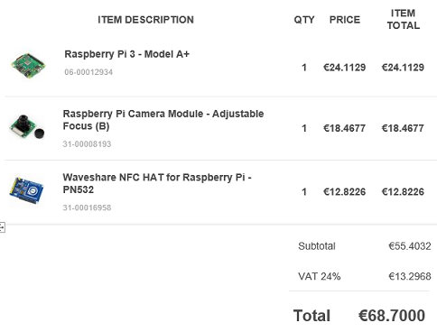

# IoT Access Control with AWS Rekognition, Polly, Lambda, MQTT and Raspberry PI.

A fun AWS IoT project using Raspberry PI with camera and NFC hat to perform 2-factor authentication with RFID cards and face recognition.

## Demo

## Hardware

- Raspberry Pi 3 - Model A+
- Raspberry Pi Camera Module - Adjustable Focus
- Waveshare NFC HAT for Raspberry Pi - PN532
- RFID/NFC key tag - 13.56MHz

## BootStraping

Raspberry PI and all hardware must be setup to operate normally. Due to high energy consumption use high quality usb cable to power the RPI to be stable (<i>spent many hours to find this</i>). Official guides are adequate.

AWS Rekognition and Polly services should be enabled in your AWS account.
AWS IoT should registered Raspberry PI as a "Thing" and enable MQTT to subscribe.

Python 3 is required.

- accesscontrol.py 
Implements registration of users and access control in a single procedure. The program uses a rfid tag you define to trigger registration or recognizes other tags to handle access control
- functions.py 
Contains all functions required for face recognition with AWS rekognition service, Polly, MQTT IoT bus and others.
- lambda_function.py 
The Lambda function to be setup in AWS to be trigerred from images uploaded to an S3 bucket to perform rekognition (a template is provided for that in AWS)

## Description

### Registration
1) A tag is used to trigger registration.
2) The user scans an other tag to be identified. 
3) Then a picture is taken and tha face is matched with the tag previously scanned. The face is added in the AWS Rekognition collection
4) The system predicts the age and mood of the user. With a little modification you can support your sad or confused users.
4) Registration is completed.

### Access Control
1) The user scans his tag
2) A photo is taken and compared with collection.
3) If user is linked with the tag access is allowed, else is forbidden. (Currently feedback is only by sound, but raspberry can control doors, lockers etc)
4) This system can be hacked with the tag copied and a front photo of your face. 
5) The ultimate security can be achieved if a password is also used as a 3rd factor.

### Other
1) AWS IoT MQTT is used to sub/pub messages when a user is registered or trying access
2) Two access control methods are used,
- Calling Rekognition from Raspberry
- Uploading face image to S3 which triggers a lambda which perform recognition of image and aproves/rejects access. Result is pushed to MQTT and read my the subscribed raspberry pi.

## Lego casing
Fun case made with my 13yrs old son :blush:

## References
Project was inspired from 
- [1] Facial Recognition on Raspberry Pi using Amazon Rekognition 
- [2] Access Control System with Raspberry Pi, RFiD and AWS Rekognition

[1]: https://softwaremill.com/access-control-system-with-rfid-and-amazon-rekognition/
[2]: https://nerdynat.com/programming/2019/facial-recognition-on-raspberry-pi-using-amazon-rekognition/

## Contributing
Pull requests are welcome. 

## License
[MIT](https://choosealicense.com/licenses/mit/)